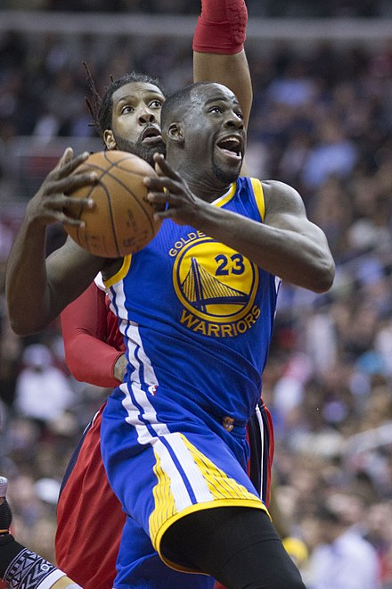
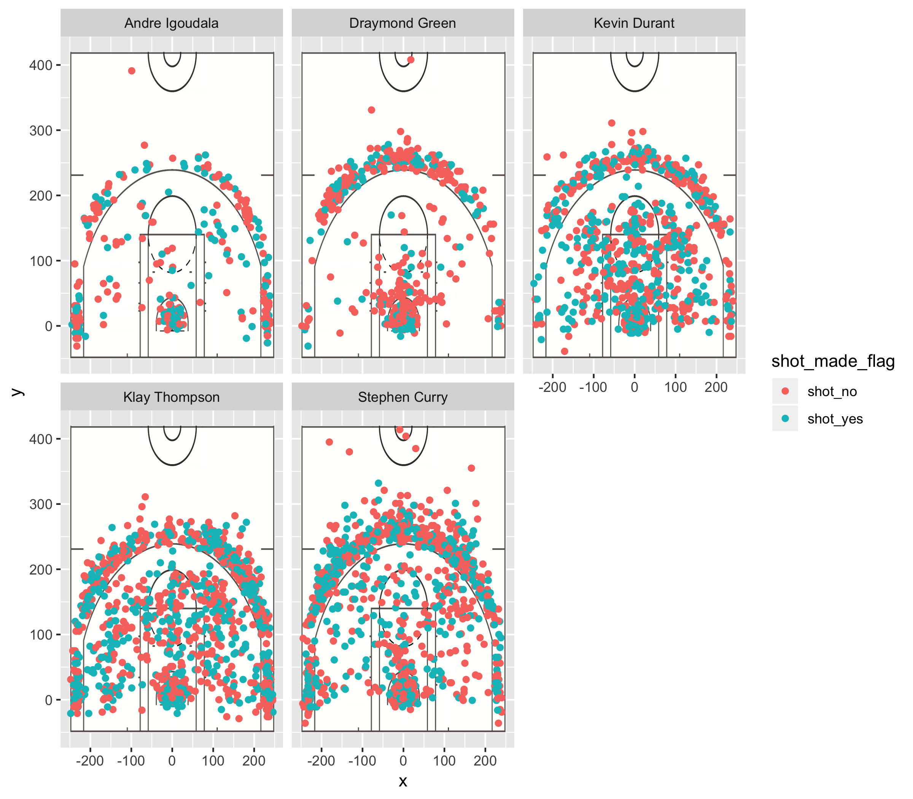

Workout1
================
Julia Vassey

Who's the best player?
----------------------

Data analysis might seem boring and oh so complicated for many of us if we think of it as a combination of numbers, regressions and statistical inferences. However, if we take a closer look, we can find data in everything that surrounds us: our homes, food and hobbies. Let's say you are a basketball fun. You like watching games and you have favorite players. You can get a kick out of this hobby by not only attending matches, watching games on TV or follow your favorite NBA stars on Instagram or Twitter. You can also get some fun facts from... data analysis. It means data can be fun if it is explained and presented in a simple, digestible way, relatable to your day-to-day life. Here is an example.

We looked at the 2016 season scoring data for the top five NBA players and calculated the field goals for each of those players.

The 2016 was very successful for Draymond Green, who was at the top of the chart, leading the list of the 2PT Field Goal players. Not surprising! Draymond Green is a three-time NBA champion and a three-time NBA All-Star.

|    X| player\_name   |  total\_shottype|  total\_shotmade|  percentage|
|----:|:---------------|----------------:|----------------:|-----------:|
|    1| Draymond Green |              346|              171|    2.023392|
|    2| Klay Thompson  |              640|              329|    1.945289|
|    3| Stephen Curry  |              563|              304|    1.851974|
|    4| Kevin Durant   |              643|              390|    1.648718|
|    5| Andre Igoudala |              210|              134|    1.567164|

But that was not the only successful scoring for Draymond Green. The player was also at the top among 3PT Field Goal players.

|    X| player\_name   |  total\_shottype|  total\_shotmade|  percentage|
|----:|:---------------|----------------:|----------------:|-----------:|
|    1| Draymond Green |              232|               74|    3.135135|
|    2| Andre Igoudala |              161|               58|    2.775862|
|    3| Kevin Durant   |              272|              105|    2.590476|
|    4| Stephen Curry  |              687|              280|    2.453571|
|    5| Klay Thompson  |              580|              246|    2.357724|

And - summarizing the results, Draymond led in total field goals in 2016, compared to his "Golden State Warriors" teammates.

|    X| player\_name   |  total\_shottype|  total\_shotmade|  percentage|
|----:|:---------------|----------------:|----------------:|-----------:|
|    1| Draymond Green |              578|              403|    1.434243|
|    2| Kevin Durant   |              915|              662|    1.382175|
|    3| Klay Thompson  |             1220|              909|    1.342134|
|    4| Stephen Curry  |             1250|              991|    1.261352|
|    5| Andre Igoudala |              371|              295|    1.257627|

Let's look at charts... Here is a different story.
--------------------------------------------------

But let' look at success from a different angle. When it comes to the number of shots, Stephen Curry led the way. The player made the largest number of shots during the 2016 season, compared to his team members.

The outcome? Data can be fun, visual and quite precise. It can show you real facts without pure speculation and turn your favorite hobby into.. science!

NBA fans are looking forward to the 2017 season and are anxiously waiting who will become the next star.

[References: Draymond Green](https://en.wikipedia.org/wiki/Draymond_Green)
